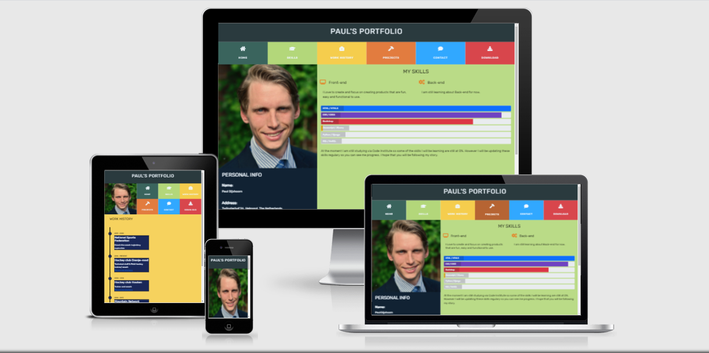

<h1 align="center">Paul's Portfolio website</h1>

[View the live project here.](https://pjdijxhoorn.github.io/milestone1/) 

This is my portfolio website. 
The site is responsive, so it is made to be viewed with ease on phone, tablet, 
and desktop. 
This so that future employers and clients can visit my website without any problems.

<h2 align="center"></h2>


## User Experience (UX)

-   ### User stories

    -   #### First Time Visitor Goals

        1. As a First Time Visitor, I want to know more about Paul Dijxhoorn.
        2. As a First Time Visitor, I want to have no trouble finding all information therefore I want a clear cut navigation.
        3. As a First Time Visitor, I want to know what others think of Paul.

    -   #### Returning Visitor Goals

        1. As a Returning Visitor, I want to be able to contact Paul for a job or projects to work on.
        2. As a Returning Visitor, I want to know more of Pauls work history.

    -   #### Frequent User Goals
        1. As a Frequent User, I want to see what the progress of Paul is of his course.
        2. As a Frequent User, I want to see what new projects Paul has created.
       

-   ### Design
    -   #### Colour Scheme
        -   There are six colours used on this website. Each of the six colours corresponds to a specific area of the website.
            With lighter colour variations to distinguish between menu buttons, and the content areas. 
    -   #### Typography
        -   The Font-family used on the website is "Rubik" this is a modern and easy to read font. As back-up in the case Rubik fails there is sans-serif.   
    -   #### Imagery
        -   The hero image is displayed in a prominent place on all device sizes to catch the attention of user's. 
            Mostly on the left of the screen because most users read from left to right.
            Furthermore, it is block-shaped to match the esthetics of the rest of the site
        

*   ### Wireframes

    -  Wireframe for Pauls Portfolio - [View](assets/wireframes/Wireframe milestone project..pdf)
    
## Features

-   Big buttons, so it is easy to navigate even on mobile devices.
-   The colors of the navbar-buttons are matching the corresponding content blocks to give a visual conformation to the users.
-   The buttons on the site are interactive to give the users visual conformation.
-   the timeline has a mouseover effect for additional information.

## Technologies Used

### Languages Used

-   [HTML5](https://en.wikipedia.org/wiki/HTML5)
-   [CSS3](https://en.wikipedia.org/wiki/Cascading_Style_Sheets)
-   [Javascript](https://en.wikipedia.org/wiki/JavaScript)

### Frameworks, Libraries & Programs Used

1. [Bootstrap 5.0.x:](https://getbootstrap.com/docs/5.0/getting-started/introduction/)
    - Bootstrap was used to create the rows and columns and to make the website more responsive.
1. [Hover.css:](https://ianlunn.github.io/Hover/)
    - Hover.css was used for all the menu buttons, the project photo's and the social links.
1. [Google Fonts:](https://fonts.google.com/)
    - Google fonts was used to get the 'Rubik' font into the style.css file. 'Rubik' is used throughout the whole website.
1. [Font Awesome:](https://fontawesome.com/)
    - Font Awesome was used for all the menu-bar icons and all the social links of this website.
1. [GitHub:](https://github.com/)
    - GitHub was used to store all the code and the code was pushed from Webstorm.
1. [Balsamiq:](https://balsamiq.com/)
    - Balsamiq was used to make the [wireframes](assets/wireframes/Wireframe milestone project..pdf) during the design process.
1. [Webstorm:](https://www.jetbrains.com/webstorm/)
    -  Webstorm was used as coding editor.

## Testing

Webstorm has a build-in code validator, So the code was checked at the moment it was written.
However, the code was also tested using the W3C Markup Validator and W3C CSS Validator Services, 
to make sure that there weren't any syntax errors in the project.

-   [W3C Markup Validator](https://jigsaw.w3.org/css-validator/#validate_by_input) 

    
-   [W3C CSS Validator](https://jigsaw.w3.org/css-validator/#validate_by_input) 

    


### Testing User Stories from User Experience (UX) Section

-   #### First Time Visitor Goals
    1. As a First Time Visitor, I want to know more about Paul Dijxhoorn.
    
        1. On the first page you get to see the navigation bar, the side bar with hero image, and the about me section. all providing basic information.
        2. From the homepage you have 4 navigation buttons to get to more specific info SKILLS, WORK-HISTORY, PROJECTS, DOWNLOAD.
        3. At the bottom of the about me there is another link to the CV.

    2. As a First Time Visitor, I want to have no trouble finding all information therefore I want a clear cut navigation.

        1. All the pages have a clear Navigation-bar. the colors of the bar are matching the content blocks of said pages to ensure that users know where the are. 
        2. All external links are openend in new windows to ensure that users do not lose the site. 
        3. There are 4 buttons to social network sites in the footer of every page.

    3. As a First Time Visitor, I want to know what others think of Paul.

        1. In the footer of all the pages there are four icons linking to Twitter, Facebook,Instagram and LinkedIn.
        2. On the Work history page there are letters of recommendation matched to the jobs the belong to.

-   #### Returning Visitor Goals

    1. As a Returning Visitor, I want to be able to contact Paul for a job or projects to work on.

        1. On the navigation bar you can see the contact button. .
        2. Here there is a form to come in contact.
        3. In the footer there are links to Twitter, Facebook, Instagram and LinkedIn.
        4. On the homepage and skill page You can find the address, number and mail of Paul.

    2. As a Returning Visitor, I want to know more of Pauls work history and projects.

        1. The work history page is easy to find on the navigation bar.
        2. Here you can find  the work history and recommendations.
        3. The Projects button is clearly visible on the navigation bar.
        4. On the project page you can see the images straight away.

-   #### Frequent User Goals

    1. As a Frequent User, I want to see what the progress of Paul is of his course.

        1. The User knows the site and that the skill progress bars with description can be found on the skills page. 

    2. As a Frequent User, I want to see what new projects Paul has created.

        1. The user Knows how to find the projects page already.
        2. New projects will be placed at the top of the content block.
    

### Further Testing

-   The website was tested on Google Chrome, Microsoft Edge .
-   The website was tested with a android phone, a desktop, a laptop and an ipad. The pages were tested vigorously to make sure that all the links were working and that 
-   The pages were tested vigorously to make sure that all the links were working and that external links were openend in new tabs.


### Known Bugs

-   The description field of the contact form has white several white spaces, and the placeholder doesn't show unless you remove the whitespaces.


## Deployment

### GitHub Pages

The project was deployed to GitHub Pages using the following steps...

1. Log in to GitHub and locate the [GitHub Repository](https://github.com/)
2. At the top of the Repository (not top of page), locate the "Settings" Button on the menu.
    - Alternatively Click [Here](https://raw.githubusercontent.com/) for a GIF demonstrating the process starting from Step 2.
3. Scroll down the Settings page until you locate the "GitHub Pages" Section.
4. Under "Source", click the dropdown called "None" and select "Master Branch".
5. The page will automatically refresh.
6. Scroll back down through the page to locate the now published site [link](https://github.com) in the "GitHub Pages" section.

### Forking the GitHub Repository

By forking the GitHub Repository we make a copy of the original repository on our GitHub account to view and/or make changes without affecting the original repository by using the following steps...

1. Log in to GitHub and locate the [GitHub Repository](https://github.com/)
2. At the top of the Repository (not top of page) just above the "Settings" Button on the menu, locate the "Fork" Button.
3. You should now have a copy of the original repository in your GitHub account.

### Making a Local Clone

1. Log in to GitHub and locate the [GitHub Repository](https://github.com/)
2. Under the repository name, click "Clone or download".
3. To clone the repository using HTTPS, under "Clone with HTTPS", copy the link.
4. Open Git Bash
5. Change the current working directory to the location where you want the cloned directory to be made.
6. Type `git clone`, and then paste the URL you copied in Step 3.

```
$ git clone https://github.com/YOUR-USERNAME/YOUR-REPOSITORY
```

7. Press Enter. Your local clone will be created.

```
$ git clone https://github.com/YOUR-USERNAME/YOUR-REPOSITORY
> Cloning into `CI-Clone`...
> remote: Counting objects: 10, done.
> remote: Compressing objects: 100% (8/8), done.
> remove: Total 10 (delta 1), reused 10 (delta 1)
> Unpacking objects: 100% (10/10), done.
```

Click [Here](https://help.github.com/en/github/creating-cloning-and-archiving-repositories/cloning-a-repository#cloning-a-repository-to-github-desktop) to retrieve pictures for some of the buttons and more detailed explanations of the above process.

## Credits

### Code

-   [Bootstrap 5.0.x](https://getbootstrap.com/docs/5.0/getting-started/introduction/): 
    The Bootstrap Library was used for the responsiveness of their grid system. 
    Some bootstrap was also used for the progress bars of the skills page.

-   The mini project with bootstrap from Code Institute was inspiration for the timeline and progress bar. 

### Content

-   All content was written by the developer.

### Media

-   All Images were created by the developer.

### Acknowledgements

-   My Mentor for continuous helpful feedback.
-   My Brother for the advice about the javascript part.
-   Family and friends for testing.
