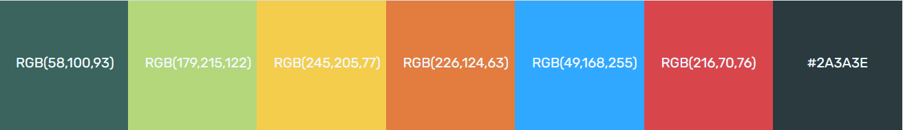

<h1 align="center">Paul's Portfolio website</h1>

[View the live project here.](https://pjdijxhoorn.github.io/milestone1/) 

This is my portfolio website. The goal of this website is  that potential future 
employees and clients can easily get an insight in my skills via my skill, work history, 
project and CV pages. With the social links and letters of recommendation located  on the 
work-history page the users can get to know about my personality and work ethics.  
The site is responsive, so it is made to be viewed with ease on a phone, tablet, 
and desktop. 

<h2 align="center"></h2>


## User Experience (UX)

-   ### User stories

    -   #### First Time Visitor Goals

        1. As a First Time Visitor, I want to know more about Paul Dijxhoorn.
        2. As a First Time Visitor, I want to have no trouble finding all information therefore I want a clear cut navigation.
        3. As a First Time Visitor, I want to know what others think of Paul trough they work history tab to find recommendations.

    -   #### Returning Visitor Goals

        1. As a Returning Visitor, I want to be able to contact Paul for a job or projects to work on.
        2. As a Returning Visitor, I want to know more of Pauls work history.

    -   #### Frequent User Goals
        1. As a Frequent User, I want to see what the progress of Paul is of his course.
        2. As a Frequent User, I want to see what new projects Paul has created.
       

-   ### Design
    -   #### Colour Scheme
        Within this website There are seven colours used.
        
        <h2 align="center"></h2>
            
        The 6 colors of the Menu corresponds to a specific area of the website.
        With lighter colour variations to distinguish between menu buttons, and the content areas.
        To make sure the site was usable for colorblind people the colors were tested with
        https://contrastchecker.com/. 
        
        The color test - [View](assets/validation/my-wcag-color-samples.pdf)
    
        Aliceblue and black were used as text colors based on the visibility of the contrast checker.
        With exception of the menu bar where only aliceblue was used to maintain an even color scheme.
        
    -   #### Typography
        -   The Font-family used on the website is "Rubik" this is a modern and easy to read font. As back-up in the case Rubik fails there is sans-serif.   
    -   #### Imagery
        -   The hero image is displayed in a prominent place on all device sizes to catch the attention of user's. 
            Mostly on the left of the screen because most users read from left to right.
            Furthermore, it is block-shaped to match the esthetics of the rest of the site.
        

*   ### Wireframes

    -  Wireframe for Pauls Portfolio - [View](assets/wireframes/Wireframe milestone project..pdf)
    
## Features

###general

-   The navigation bar has big buttons, so it is easy to navigate even on mobile devices.
-   The colors of the navbar-buttons are matching the corresponding content blocks to give a visual conformation to the users.
-   The buttons on the site are interactive to give the users visual conformation. when they mouse over.

###home
-   The about me has a call to action directing to the CV and contact page.

###skills
-   The skills page has a progress bar for several skills which will be updated when Paul 
    increases his skills.

###work history
-   On the work history page is a timeline of Paul his work history.
-   The Job blocks have a mouseover effect that display a new block 
    which provides additional information. 
    Here javascript was used to achieve this effect. 
    This effect will be updated to more smooth animation when paul has finished his javascript part of the course.
    
###projects
-   The project page shows several assignments that were done by Paul these are just screenshots since none of them are life.
    As more projects are build and come online these will be linked to the site.
    
###contact
-   the contact page has a contact form. 
    this form will not really send an email this is a feature that will be added in the future.
    for now it leads to a thank-you page.
###download
-   the download button leads to a pdf file of the CV of Paul.

## Technologies Used

### Languages Used

-   [HTML5](https://en.wikipedia.org/wiki/HTML5)
-   [CSS3](https://en.wikipedia.org/wiki/Cascading_Style_Sheets)
-   [Javascript](https://en.wikipedia.org/wiki/JavaScript)

### Frameworks, Libraries & Programs Used

1. [Bootstrap 5.0.x:](https://getbootstrap.com/docs/5.0/getting-started/introduction/)
    - Bootstrap was used to create the rows and columns and to make the website more responsive.
1. [Hover.css:](https://ianlunn.github.io/Hover/)
    - Hover.css was used for all the menu buttons, the project photo's and the social links.
1. [Google Fonts:](https://fonts.google.com/)
    - Google fonts was used to get the 'Rubik' font into the style.css file. 'Rubik' is used throughout the whole website.
1. [Font Awesome:](https://fontawesome.com/)
    - Font Awesome was used for all the menu-bar icons and all the social links of this website.
1. [GitHub:](https://github.com/)
    - GitHub was used to store all the code and the code was pushed from Webstorm.
1. [Balsamiq:](https://balsamiq.com/)
    - Balsamiq was used to make the [wireframes](assets/wireframes/Wireframe milestone project..pdf) during the design process.
1. [Webstorm:](https://www.jetbrains.com/webstorm/)
    -  Webstorm was used as coding editor.

## Testing

Webstorm has a build-in code validator, So the code was checked at the moment it was written.
However, the code was also tested using the W3C Markup Validator and W3C CSS Validator Services, 
to make sure that there weren't any syntax errors in the project.

-   [W3C Markup Validator](https://validator.w3.org/) 

    
-   [W3C CSS Validator](https://jigsaw.w3.org/css-validator/#validate_by_input) 

    


### Testing User Stories from User Experience (UX) Section

-   #### First Time Visitor Goals
    1. As a First Time Visitor, I want to know more about Paul Dijxhoorn.
    
        1. On the first page you get to see the navigation bar, the side bar with hero image, and the about me section. all providing basic information.
        2. From the homepage you have 4 navigation buttons to get to more specific info SKILLS, WORK-HISTORY, PROJECTS, DOWNLOAD.
        3. At the bottom of the about me there is another link to the CV.

    2. As a First Time Visitor, I want to have no trouble finding all information therefore I want a clear cut navigation.

        1. All the pages have a clear Navigation-bar. the colors of the bar are matching the content blocks of said pages to ensure that users know where the are. 
        2. All external links are openend in new windows to ensure that users do not lose the site. 
        3. There are 4 buttons to social network sites in the footer of every page.

    3. As a First Time Visitor, I want to know what others think of Paul.

        1. In the footer of all the pages there are four icons linking to Twitter, Facebook,Instagram and LinkedIn.
        2. On the Work history page there are letters of recommendation matched to the jobs the belong to.

-   #### Returning Visitor Goals

    1. As a Returning Visitor, I want to be able to contact Paul for a job or projects to work on.

        1. On the navigation bar you can see the contact button. .
        2. Here there is a form to come in contact.
        3. In the footer there are links to Twitter, Facebook, Instagram and LinkedIn.
        4. On the homepage and skill page You can find the address, number and mail of Paul.

    2. As a Returning Visitor, I want to know more of Pauls work history and projects.

        1. The work history page is easy to find on the navigation bar.
        2. Here you can find  the work history and recommendations.
        3. The Projects button is clearly visible on the navigation bar.
        4. On the project page you can see the images straight away.

-   #### Frequent User Goals

    1. As a Frequent User, I want to see what the progress of Paul is of his course.

        1. The User knows the site and that the skill progress bars with description can be found on the skills page. 

    2. As a Frequent User, I want to see what new projects Paul has created.

        1. The user Knows how to find the projects page already.
        2. New projects will be placed at the top of the content block.
    

### Further Testing

-   The website was tested on Google Chrome, Microsoft Edge .
-   The website was tested with a android phone, a desktop, a laptop and an ipad. The pages were tested vigorously to make sure that all the links were working and that 
-   The pages were tested vigorously to make sure that all the links were working and that external links were opened in new tabs.


### Known Bugs

-   The content blocks were overlapping the menu-bar on tablet and phone.   <ins>**fixed!**</ins>
    
    The header height and body absolute code made the content jump up.
    Found after 2 days of frustration.
    
-   The hero images looks stretched on phone    <ins>**fixed!**</ins>
    
    The height in px and the width in % made it look stretched.
-   The code validator flaged the comments      <ins>**fixed!**</ins>
    Comments had 1 - to many.
-   The description field of the contact form has white several white spaces, and the placeholder doesn't show unless you remove the whitespaces.


## Deployment

### GitHub Pages

The project was deployed to GitHub Pages using the following steps...

1. First sign in to GitHub and locate the [GitHub Repository](https://github.com/pjdijxhoorn/milestone1)
2. Under the github logo left upper corner you have the repository name. Under that is menu bar. Here you click settings.
3. On this new page you scroll down all the way untill you see "GitHub Pages" Section.
4. After finding the  "GitHub Pages" Section you click the branch button under "source" instead of none you select "master".
5. The page should refresh itself.
6. After this Scroll down to "Github Pages" again here you should see the deployed site [link](https://pjdijxhoorn.github.io/milestone1/).

### Forking the GitHub Repository
When you fork a repository on Github you make a copy of the original. By doing this you can view and make changes 
without the original changing. you can fork the repository with these steps:

1. Locate the  [GitHub Repository](https://github.com/pjdijxhoorn/milestone1) After you logged in.
2. On the left top of the site you will find the fork button press it.
3. This should provide you with a copy of the repository in your own github account.

### Making a Local Clone

1. Sign in/up to Github and go to the main page of the repository [GitHub Repository](https://github.com/pjdijxhoorn/milestone1)
2. Above the files  click the button for Code.
3. Copy the link under the HTTPS tab.
4. Open your code editor.
5. open a new work directory, or a existing one where you want the directory to be created.
6. in the command line write `git clone`, and after that paste the URL you from Step 3 and hit enter.

```
$ git clone https://github.com/pjdijxhoorn/milestone1.git
```

```
$ git clone https://github.com/pjdijxhoorn/milestone1.git
Cloning into 'milestone1'...
remote: Enumerating objects: 322, done.
remote: Counting objects: 100% (322/322), done.
remote: Compressing objects: 100% (186/186), done.
remote: Total 322 (delta 151), reused 271 (delta 100), pack-reused 0
Receiving objects: 100% (322/322), 11.10 MiB | 8.51 MiB/s, done.
Resolving deltas: 100% (151/151), done.
```

This [page](https://help.github.com/en/github/creating-cloning-and-archiving-repositories/cloning-a-repository#cloning-a-repository-to-github-desktop) can provide more in depth information on the process.  

## Credits

### Code

-   [Bootstrap 5.0.x](https://getbootstrap.com/docs/5.0/getting-started/introduction/): 
    The Bootstrap Library was used for the responsiveness of their grid system. 
    Some bootstrap was also used for the progress bars of the skills page.

-   The mini project with bootstrap from Code Institute was inspiration for the timeline and progress bar. 

### Content

-   All content was written by the developer.

### Media

-   All Images were created by the developer.

### Acknowledgements

-   My Mentor for continuous helpful feedback.
-   My Brother for the advice about the javascript part.
-   Family and friends for testing.
